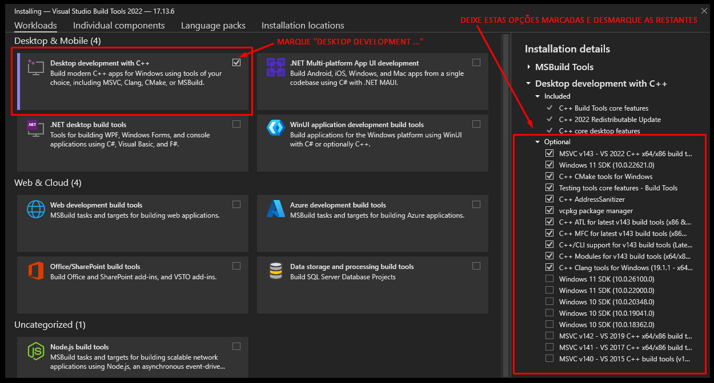

<h1 align="center">
  🎓📸 Sistema de Reconhecimento Facial para Escolas
</h1>

<p align="center">
  
  <br/>
  📷<em>Interface Web do sistema de reconhecimento facial em funcionamento...</em>
</p>

Este projeto tem como objetivo registrar a entrada e saída de alunos automaticamente por meio de **reconhecimento facial**. Utilizando **Python**, **OpenCV** e **InsightFace**, o sistema identifica os rostos dos alunos e registra sua presença no banco de dados **MySQL**. A interface web baseada em **Flask** e **WebSockets** permite exibir vídeo em tempo real, alertas persistentes e relatórios completos.

---

## 🧠 Funcionalidades

* **Reconhecimento facial em tempo real** via webcam para identificar alunos automaticamente.
* **Registro automático de entrada e saída** com data e hora no formato brasileiro (dd/mm/aaaa hh\:mm\:ss).
* **Controle de tempo entre registros** para o mesmo aluno, evitando múltiplas marcações em curto intervalo.
* **Interface web** com alertas persistentes por aluno, organizados por nome, e filtros de visualização por tipo de registro (entrada/saída).
* **Alertas mais detalhados**, como "Aluno reconhecido e entrada registrada" e "Aluno reconhecido e saída registrada".
* **Evita duplicação de alertas** por aluno, com controle de tempo configurável.
* **Acesso restrito** com login e controle de permissões para diferentes usuários.
* **Painel administrativo (Dashboard)** com visualização de dados de presença, relatórios dinâmicos e controle de registros.
* **Estatísticas de presença** e distribuição de alunos por turno ou turma no dashboard.
* **Painel administrativo (Lista de Alunos)** com CRUD completo: visualize, edite e exclua alunos pela interface web.
* **Painel administrativo (Relatórios de Presença)** com filtros avançados (por aluno, turma, data e tipo de registro).
* **Exportação de relatórios** em formatos **PDF**, **Excel** e **TXT**.
* **Cadastro de alunos com envio de foto**, turma e turno, com validações e mensagens interativas.
* **Treinamento de rostos** armazenados com uso de embeddings otimizados.
* Banco de dados relacional **MySQL** para armazenar dados de alunos e registros de presença.
* **Comunicação em tempo real** via **WebSocket** (SocketIO), permitindo atualizações instantâneas na interface.
* **Otimizações de desempenho** para ambientes com muitos alunos (resize de imagem, controle de FPS).
* **InsightFace** para melhorar a precisão e a performance do reconhecimento facial.

---

## 🚀 Tecnologias Utilizadas

<div align="left" style="display: flex; flex-wrap: wrap; gap: 10px;">
  
  
  
  
  
  
  
  
  
  
  
  
  
</div>

---

### 🧠 Inteligência Artificial & Reconhecimento Facial

* [PyTorch](https://pytorch.org/) – framework de machine learning usado para redes neurais
* [TorchVision](https://pytorch.org/vision/) / [TorchAudio](https://pytorch.org/audio/) – suporte a visão computacional e áudio
* [InsightFace](https://github.com/deepinsight/insightface) – biblioteca para reconhecimento facial baseado em embeddings
* [ONNX Runtime](https://onnxruntime.ai/) – execução eficiente de modelos pré-treinados (CPU ou GPU)

### 🖼️ Processamento de Imagens

* [OpenCV](https://opencv.org/) – manipulação de imagens e captura de vídeo
* [Pillow](https://python-pillow.org/) – processamento e salvamento de imagens

### 📊 Manipulação de Dados e Relatórios

* [NumPy](https://numpy.org/) – arrays numéricos de alto desempenho
* [Pandas](https://pandas.pydata.org/) – manipulação e análise de dados
* [OpenPyXL](https://openpyxl.readthedocs.io/) – criação e leitura de arquivos Excel (.xlsx)
* [XlsxWriter](https://xlsxwriter.readthedocs.io/) – geração avançada de planilhas Excel
* [ReportLab](https://www.reportlab.com/) – geração de arquivos PDF

### 🌐 Backend e Comunicação em Tempo Real

* [Flask](https://flask.palletsprojects.com/) – microframework web para Python
* [Flask-SocketIO](https://flask-socketio.readthedocs.io/) – comunicação WebSocket em tempo real
* [Flask-CORS](https://flask-cors.readthedocs.io/) – suporte a CORS
* [Gevent](https://www.gevent.org/) – servidor assíncrono baseado em greenlets
* [gevent-websocket](https://pypi.org/project/gevent-websocket/) – suporte WebSocket para gevent
* [python-socketio](https://python-socketio.readthedocs.io/) – cliente e servidor WebSocket
* [python-engineio](https://python-engineio.readthedocs.io/) – motor de transporte para SocketIO
* [python-dotenv](https://pypi.org/project/python-dotenv/) – carregamento de variáveis de ambiente via `.env`
* [Gunicorn](https://gunicorn.org/) – servidor WSGI para ambientes de produção com Flask

### 🐬 Banco de Dados MySQL

* [mysql-connector-python](https://dev.mysql.com/doc/connector-python/en/) – conector oficial da Oracle para MySQL em Python

### 📅 Agendamento de Tarefas

* [APScheduler](https://apscheduler.readthedocs.io/) – agendador de tarefas com suporte a cron, intervalos e datas fixas

### 🎨 Frontend e Estilização

* [HTML5](https://developer.mozilla.org/pt-BR/docs/Web/HTML)
* [CSS3](https://developer.mozilla.org/pt-BR/docs/Web/CSS)
* [JavaScript](https://developer.mozilla.org/pt-BR/docs/Web/JavaScript)
* [Tailwind CSS](https://tailwindcss.com/) – framework CSS utilitário
* [FontAwesome](https://fontawesome.com/) – ícones para web

### 🛠️ Empacotamento e Build

* [PyInstaller](https://pyinstaller.org/) – empacotamento de aplicativos Python em executáveis
* [setuptools](https://pypi.org/project/setuptools/) / [wheel](https://pypi.org/project/wheel/) – empacotamento e distribuição de projetos Python

---

## 💻 Requisitos do Sistema

| **🔸 Mínimos** | **🔹 Recomendados** |
|----------------|----------------------|
| Sistema e processador de 64 bits | Sistema e processador de 64 bits |
| **SO:** Windows 10 / Ubuntu 20.04 / macOS 10.15 | **SO:** Windows 10 ou 11 / Ubuntu 22.04 / macOS 12 ou superior |
| **Processador:** Intel Core i5-8250U / AMD Ryzen 5 2500U | **Processador:** Intel Core i5 (9ª gen) / AMD Ryzen 5 3600 |
| **Memória RAM:** 8 GB | **Memória RAM:** 16 GB |
| **GPU:** Gráficos integrados Intel UHD 620 ou superior | **GPU:** NVIDIA GTX 1050 ou superior (opcional, para aceleração CUDA) |
| **Armazenamento:** 256 GB SSD | **Armazenamento:** 512 GB SSD |
| **Webcam:** 720p (HD), 30 FPS, foco fixo | **Webcam:** 1080p (Full HD), 30 FPS ou superior, foco fixo |

---

## 📌 Requisitos de Instalação

### 1️⃣ Instale o Python 3.10

Baixe o Python pelo site oficial:  
🔗 [https://www.python.org/downloads/release/python-3100/](https://www.python.org/downloads/release/python-3100/)

Download direto (Windows 64 bits):  
🔗 [https://www.python.org/ftp/python/3.10.0/python-3.10.0-amd64.exe](https://www.python.org/ftp/python/3.10.0/python-3.10.0-amd64.exe)

> ⚠️ **Importante:**  
> Marque a opção **"Add Python to PATH"** na instalação.

#### 💡 Por que a versão 3.10?

Algumas bibliotecas utilizadas (como `insightface`, `onnxruntime` e `torch`) ainda **não têm suporte completo no Python 3.11+**, podendo gerar erros de instalação. Por isso, **recomenda-se o Python 3.10**.

---

### 2️⃣ Instale o Visual Studio Build Tools (Windows)

Baixe em:  
🔗 [https://visualstudio.microsoft.com/visual-cpp-build-tools/](https://visualstudio.microsoft.com/visual-cpp-build-tools/)

- Marque o pacote **"Desenvolvimento para C++ Desktop"**
- Inclua o **MSVC v14.x** (v142 ou superior)

> Após a instalação, **reinicie o computador**.

<details>
  <summary>🖼️ Clique aqui para ver um exemplo do que selecionar na instalação</summary>

  

</details>

---

### 3️⃣ Atualize `pip`, `setuptools` e `wheel`

Antes de instalar as dependências:

```bash
python -m pip install --upgrade pip setuptools wheel
```

---

### 4️⃣ Instale as dependências do projeto

Com o arquivo `requirements.txt`:

```bash
pip install -r requirements.txt
```

Isso instalará:

- **Dados e relatórios:** `numpy`, `pandas`, `openpyxl`, `XlsxWriter`, `reportlab`
- **Imagens e vídeo:** `opencv-python`, `pillow`
- **IA e reconhecimento facial:** `torch`, `torchvision`, `torchaudio`, `insightface`, `onnxruntime`
- **Web backend:** `flask`, `flask-cors`, `flask-socketio`, `gevent`, `gevent-websocket`, `python-dotenv`
- **Banco de dados:** `mysql-connector-python`
- **Tarefas agendadas:** `apscheduler`
- **Build e distribuição:** `setuptools`, `wheel`, `pyinstaller`
- **Produção:** `gunicorn`

#### 📦 Instalação manual (opcional e não recomendada):

```bash
pip install numpy==1.24.4 pandas==2.2.1 openpyxl==3.1.2 XlsxWriter==3.1.2 reportlab==4.1.0
pip install opencv-python==4.8.0.76 pillow==10.3.0
pip install torch==2.2.1 torchvision==0.17.1 torchaudio==2.2.1 insightface==0.7.3
pip install onnxruntime==1.21.0  # ou onnxruntime-gpu==1.21.0 se usar CUDA
pip install flask==3.1.0 flask-cors==5.0.1 flask-socketio==5.3.0 gevent==21.12.0 gevent-websocket==0.10.1
pip install python-socketio==5.5.2 python-engineio==4.3.2 python-dotenv==1.0.1
pip install mysql-connector-python==8.0.33
pip install apscheduler==3.10.4
pip install setuptools==69.5.1 wheel==0.43.0 pyinstaller==6.5.0
```

---

### 5️⃣ Instale e configure o MySQL

#### ✅ Recomendado: MySQL 8.0.33 ou superior

- Baixe: [https://dev.mysql.com/downloads/mysql/](https://dev.mysql.com/downloads/mysql/)
- Durante a instalação, **selecione o método de autenticação _Legacy_ (`mysql_native_password`)**

> ⚠️ **Evite versões antigas (5.x)** que podem causar problemas com o `mysql-connector-python`.

#### 🗃️ Criação do banco de dados e tabelas

Com o MySQL instalado e em execução, abra o terminal do MySQL e execute os comandos abaixo para criar o banco de dados e suas respectivas tabelas. Você também pode baixar o arquivo SQL com os comandos prontos para importar diretamente:

- [Baixar o arquivo `reconhecimento_facial.sql`](./app/database/reconhecimento_facial.sql)

Ou, caso prefira, execute os comandos abaixo manualmente:

```sql
CREATE DATABASE IF NOT EXISTS reconhecimento_facial
  DEFAULT CHARACTER SET utf8mb4
  DEFAULT COLLATE utf8mb4_unicode_ci;

USE reconhecimento_facial;

-- Tabela de alunos
CREATE TABLE `alunos` (
  `id` int(11) NOT NULL AUTO_INCREMENT,
  `nome` varchar(255) NOT NULL,
  `foto` varchar(255) NOT NULL,
  `turno` enum('manhã','tarde','integral') NOT NULL DEFAULT 'integral',
  `turma` varchar(10) NOT NULL,
  PRIMARY KEY (`id`)
) ENGINE=InnoDB DEFAULT CHARSET=utf8mb4 COLLATE=utf8mb4_unicode_ci;

-- Tabela de configurações
CREATE TABLE `configuracoes` (
  `id` int(11) NOT NULL AUTO_INCREMENT,
  `nome_configuracao` varchar(255) NOT NULL,
  `valor` int(11) NOT NULL,
  `tipo` enum('minutos','horas') NOT NULL DEFAULT 'minutos',
  `descricao` varchar(255) NOT NULL,
  PRIMARY KEY (`id`)
) ENGINE=InnoDB DEFAULT CHARSET=utf8mb4 COLLATE=utf8mb4_unicode_ci;

-- Inserindo configuração inicial
INSERT INTO `configuracoes` (`id`, `nome_configuracao`, `valor`, `tipo`, `descricao`) VALUES
(1, 'tempo_espera', 3, 'minutos', 'Tempo de espera entre registros de entrada e saída');

-- Tabela de fotos dos alunos
CREATE TABLE `fotos_alunos` (
  `id_foto` int(11) NOT NULL AUTO_INCREMENT,
  `id_aluno` int(11) NOT NULL,
  `foto_nome` varchar(255) NOT NULL,
  PRIMARY KEY (`id_foto`),
  KEY `id_aluno` (`id_aluno`),
  CONSTRAINT `fotos_alunos_ibfk_1` FOREIGN KEY (`id_aluno`) REFERENCES `alunos` (`id`) ON DELETE CASCADE ON UPDATE CASCADE
) ENGINE=InnoDB DEFAULT CHARSET=utf8mb4 COLLATE=utf8mb4_unicode_ci;

-- Tabela de registros de presença
CREATE TABLE `registros_presenca` (
  `id` int(11) NOT NULL AUTO_INCREMENT,
  `id_aluno` int(11) DEFAULT NULL,
  `tipo_registro` enum('entrada','saida') NOT NULL,
  `data_hora` timestamp NOT NULL DEFAULT current_timestamp(),
  `turma` varchar(10) NOT NULL,
  PRIMARY KEY (`id`),
  KEY `id_aluno` (`id_aluno`),
  CONSTRAINT `registros_presenca_ibfk_1` FOREIGN KEY (`id_aluno`) REFERENCES `alunos` (`id`) ON UPDATE CASCADE
) ENGINE=InnoDB DEFAULT CHARSET=utf8mb4 COLLATE=utf8mb4_unicode_ci;

-- Tabela de usuários
CREATE TABLE `usuarios` (
  `id` int(11) NOT NULL AUTO_INCREMENT,
  `nome` varchar(255) NOT NULL,
  `email` varchar(255) NOT NULL,
  `senha` varchar(255) NOT NULL,
  `is_admin` tinyint(1) NOT NULL DEFAULT 0,
  PRIMARY KEY (`id`),
  UNIQUE KEY `email` (`email`)
) ENGINE=InnoDB DEFAULT CHARSET=utf8mb4 COLLATE=utf8mb4_unicode_ci;

---

### 6️⃣ Configuração das Variáveis de Ambiente
Crie um arquivo **.env** na raiz do projeto e adicione suas credenciais do banco de dados:

```ini
DB_HOST=localhost
DB_USER=root
DB_PASSWORD=
DB_NAME=reconhecimento_facial
SECRET_KEY=sua_chave_secreta
```
> Esse arquivo armazena as **credenciais de acesso ao banco de dados** de forma segura, evitando a exposição de dados sensíveis no código.

---

## ▶️ Como Executar o Projeto

### 1️⃣ Inicie o servidor Flask

Abra um terminal na pasta do projeto e execute:

```sh
python run.py
```

A página de login será iniciada!

### 2️⃣ Acesso ao Sistema

💡 Se você utilizou o arquivo `reconhecimento_facial.sql` para configurar o banco de dados, acesse o sistema com as seguintes credenciais de teste:

* **E-mail:** `admin@gmail.com`
* **Senha:** `123456`

💡 Caso tenha criado o banco manualmente com os comandos SQL acima, será necessário **cadastrar um novo usuário administrador** antes de acessar o sistema. 

### 3️⃣ Reconhecimento Facial e Registro

* Quando um **rosto for reconhecido**, ele será identificado e um alerta será exibido na interface.
* O registro de **entrada ou saída** será salvo automaticamente no banco de dados.

---

## 🎯 Estrutura do Projeto

```
 reconhecimento_facial
├── 📂 app/                      # Contém a lógica principal da aplicação, incluindo rotas, serviços, reconhecimento facial, e integração com o banco de dados.
│   ├── 📂 database/             # Scripts relacionados à conexão com o banco de dados, incluindo a criação do banco e configurações iniciais.
│   ├── 📂 recognition/          # Implementações do motor de reconhecimento facial e streaming de vídeo.
│   ├── 📂 routes/               # Arquivos responsáveis pelas rotas da aplicação, divididos em funcionalidades como cadastro de alunos, relatórios, login e reconhecimento.
│   ├── 📂 services/             # Contém os serviços que lidam com a lógica de negócios da aplicação, como manipulação de alunos, controle de temperatura, geração de relatórios e autenticação.
│   ├── 📂 static/               # Contém arquivos estáticos como CSS, JavaScript e imagens.
│   │   ├── 📂 css/              
│   │   ├── 📂 imagens/          
│   │   ├── 📂 js/               
│   ├── 📂 storage/              
│   │   ├── 📂 embeddings_cash/  # Armazena os embeddings (vetores do rosto).
│   │   ├── 📂 fotos_alunos/     # Armazena as fotos.
│   ├── 📂 templates/            # Templates HTML utilizados pela aplicação.
│   ├── 📂 utils/                # Arquivos utilitários como funções auxiliares para caminhos de arquivos e outros.
│   ├── __init__.py              # Inicialização da aplicação Flask.
│   ├── extensions.py            # Extensões externas.
├── .env                         # Variáveis de ambiente.
├── README.md                    # Documentação do projeto.
├── requirements.txt             # Dependências do projeto.
└── run.py                       # Arquivo de inicialização da aplicação Flask.
```

---

## 🛠️ Lógica do Projeto

### 🔐 Módulo 1: Autenticação e Painel Administrativo

* **Sistema de login seguro** com e-mail e senha.
* **Gerenciamento de usuários:** criação de novos usuários administradores e alteração de senha.
* **Painel administrativo completo**, acessível apenas por usuários autenticados, contendo:

  * **Dashboard** com estatísticas gerais de presença.
  * **Lista de alunos** com filtros por turma e turno.
  * **Relatórios de presença** interativos e exportáveis.
  * **Cadastro de alunos** com envio de foto, identificação por turno/turma e armazenamento estruturado.

### 🧠 Módulo 2: Reconhecimento Facial e Cadastro

* **Cadastro rápido de alunos** pela interface web, com envio de imagem.
* Após o envio, o sistema gera **1 foto oficial** e **10 embeddings faciais** automaticamente usando **InsightFace**.
* **Embeddings armazenados em cache** na pasta `embeddings_cache/`, otimizando o desempenho e evitando reprocessamento.
* As fotos originais são salvas na pasta `fotos_alunos/`, organizadas por nome, ID e turma.
* Durante a execução, o **rosto capturado via webcam** é comparado em tempo real com os embeddings salvos.
* O sistema registra **entrada ou saída automática**, com base no último registro daquele aluno.
* **Alertas individuais e contextuais** são exibidos na interface durante os reconhecimentos.

### 🖥️ Módulo 3: Interface Web e Relatórios

* **Interface moderna e responsiva** construída com **TailwindCSS** e ícones Font Awesome.
* **Tela de reconhecimento facial em tempo real**, com feedback visual instantâneo e alertas informativos.
* **Comunicação em tempo real** via **SocketIO**, permitindo atualizações dinâmicas sem recarregar a página.
* **Relatórios filtráveis** por nome, turma, turno, data e tipo de registro (entrada/saída).
* **Exportação com 1 clique** em formatos **PDF**, **Excel** e **TXT**.
* **Sistema de notificações visuais** para informar ações como cadastros, reconhecimentos e falhas.

---

## 📬 Contato

Este projeto foi desenvolvido por **Angelita Luz**, com apoio fundamental de **Janes Cleston**, que idealizou o projeto e está presente em todas as fases — incentivando, ajudando a organizar, estruturar e melhorar cada detalhe. Agradeço imensamente pela confiança e pela oportunidade de construir isso juntos. 💙

👩‍💻 Angelita Luz  
🔗 [GitHub](https://github.com/angelluzk) • [LinkedIn](https://linkedin.com/in/angelitaluz)

👨‍💻 Janes Cleston  
🔗 [GitHub](https://github.com/jcleston) • [LinkedIn](https://www.linkedin.com/in/janescleston)

---